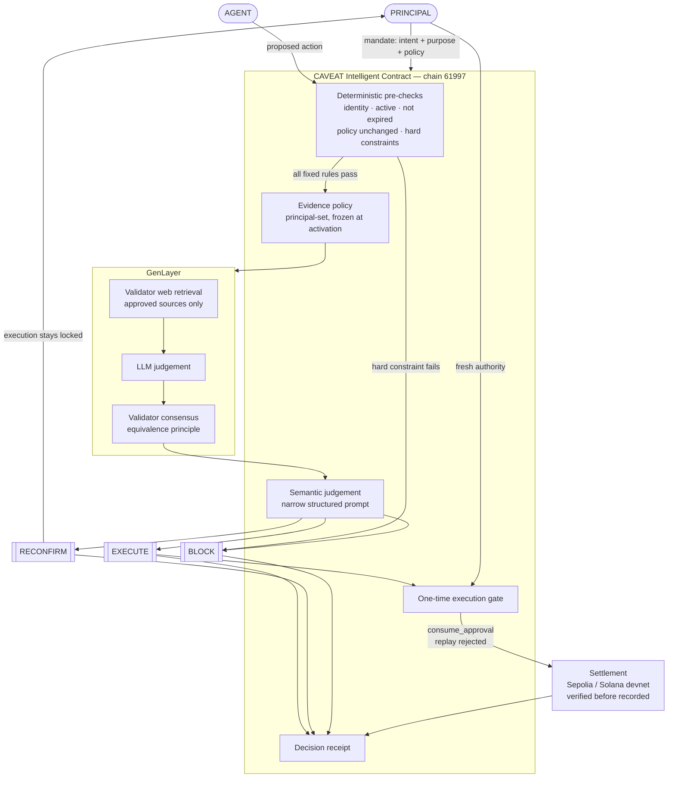

# Architecture

## At a glance



## The primitive

CAVEAT is a checkpoint that sits between an agent's *authority* and its *execution*.

```text
                          PRINCIPAL
                              │
                              │ creates mandate (intent + purpose + policy)
                              ▼
                     ┌──────────────────┐
                     │      CAVEAT      │
                     │    Intelligent   │  ← the only authority for verdicts
                     │     Contract     │
                     └────────┬─────────┘
                              │ agent submits a proposed action
                              ▼
                     ┌──────────────────┐
                     │  Deterministic   │  agent identity · mandate active ·
                     │   pre-checks     │  not expired · policy unchanged ·
                     └────────┬─────────┘  budget · destination · refundability
                              │
             fails ───────────┴────────── passes
               │                            │
               ▼                            ▼
             BLOCK                 ┌──────────────────┐
        (no model call)            │ Evidence policy  │  approved sources only,
                                   │ (frozen at       │  fixed by the principal
                                   │  activation)     │
                                   └────────┬─────────┘
                                            ▼
                                   ┌──────────────────┐
                                   │     GenLayer     │
                                   │  web retrieval   │
                                   │  + LLM judgement │
                                   │  + consensus     │
                                   └────────┬─────────┘
                                            │
                        ┌───────────────────┼───────────────────┐
                        ▼                   ▼                   ▼
                     EXECUTE            RECONFIRM             BLOCK
                        │                   │                   │
                        ▼                   ▼                   ▼
                 unlock one-time      pause, execution      reject; no
                 execution gate       stays locked          execution path
                        │                   │
                        │                   │ principal supplies fresh authority
                        │                   ▼
                        │            mandate commitment re-issued
                        ▼
                 consume_approval  →  settlement (Sepolia / Solana devnet),
                 (replay rejected)     verified before it is recorded
                        │
                        ▼
                 Decision receipt: mandate · proposal · checks · evidence digest
                                   · verdict · reason · timestamps · settlement
```

## Layers

| Layer | Where | Responsibility |
| --- | --- | --- |
| Intelligent Contract | `contracts/caveat.py`, GenLayer chain 61997 | All state, all deterministic checks, all evidence retrieval, all verdicts, the execution gate, the receipts |
| Console | `app/`, `components/`, `lib/` | Reads authoritative state, submits signed transactions, displays decisions. Computes nothing |
| Scripts | `scripts/` | Deployment and end-to-end lifecycle runs; produce evidence artifacts |
| Tests | `test/direct`, `test/integration` | In-process behaviour, then the same behaviour on the real network |

## Why GenLayer

The checkpoint needs four things at once, and an ordinary chain gives none of them:

1. **Natural-language intent.** The mandate is the principal's own words. The comparison that matters — does this action still serve that purpose — is semantic, not arithmetic.
2. **External web evidence.** The world state that invalidates a mandate lives off-chain, on a schedule page or a supplier's site. GenLayer validators fetch it themselves, so the proposing agent never gets to say what the evidence is.
3. **Non-deterministic judgement.** The residue that deterministic code cannot decide is exactly where an LLM belongs, under a narrow structured prompt.
4. **Validator consensus.** A single model answer is an opinion. The equivalence principle makes the verdict a consensus result, which is what makes it usable as an authorization gate.

## Generic core, travel adapter

Nothing in the contract knows what a flight is. It stores an `action_type`, an opaque
`action_payload`, and a list of hard constraints expressed as `{field, op, value}` over
paths in that payload. The travel adapter is a set of constraint definitions and one
evidence question, supplied at mandate creation. Procurement, SaaS renewal, marketplace
purchase and treasury actions are new adapters on the same primitive, not new contracts.

## Decision ordering (and why it matters)

Deterministic checks run first, unconditionally, and a hard-constraint failure returns
`BLOCK` without touching the network or a model. This is not an optimisation:

- fixed rules must not be subject to model variance,
- a prohibited action should cost nothing to reject,
- and the semantic checkpoint should only ever see actions that are already formally valid,
  which is what makes a `RECONFIRM` meaningful.

## Failure posture

| Situation | Behaviour |
| --- | --- |
| Approved source unreachable or silent | Recorded `UNAVAILABLE`, internal `INCONCLUSIVE`, public `RECONFIRM`. No judgement is attempted |
| Principal-pinned fallback claim used | Recorded `FALLBACK`; the verdict is capped so it can never be `EXECUTE` |
| Model returns an unusable verdict | `JUDGEMENT_INCONCLUSIVE`, surfaced as `RECONFIRM` |
| Mandate policy re-issued under a pending proposal | `Policy unchanged` check fails → `BLOCK` |
| Approval already consumed | The second attempt reverts on chain |
| Settlement hash unverifiable | Refused, not stored |
